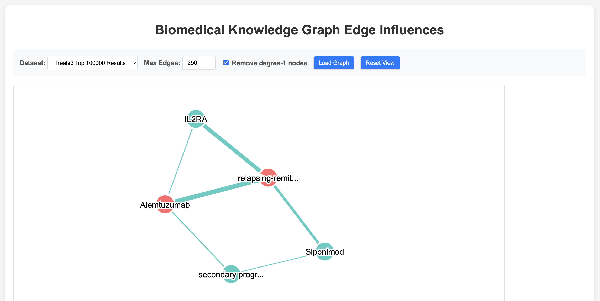

# Biomedical Knowledge Graph Edge Influence Visualization

## What is this project?

This tool helps researchers understand **why** a machine learning model predicts certain relationships in biomedical knowledge graphs. 

When a model predicts that "Drug X treats Disease Y", this visualization shows you **which training data influenced that prediction** and **how strongly**. Think of it as "explainable AI" for biomedical predictions.



*Example visualization showing how training edges influence the prediction "Alemtuzumab treats relapsing-remitting multiple sclerosis". Red nodes are prediction entities, teal nodes are training entities, with edge thickness indicating influence strength.*

### The Problem We're Solving

- 🤖 **Machine learning models** make predictions about drug-disease relationships
- ❓ **But why did it make that prediction?** Which training examples influenced it?
- 🔍 **This tool visualizes the "influence"** of training edges on test predictions
- 📊 **Higher influence scores** = more important for the prediction

## Quick Start Guide

### Prerequisites

1. **Conda environment**: You need the `trac` conda environment with Flask installed
2. **Input data**: Large CSV file with influence scores (already provided)

### Step 1: Process Your Data

The raw input file is huge (~2GB), so first extract the most influential edges:

```bash
# Get the top 100,000 most influential edges (recommended starting point)
python src/top_scores.py 100000
```

This creates `filtered_data/top_100000_results.csv` with just the highest-scoring influences.

### Step 2: Start the Visualization

```bash
# Activate the conda environment
conda activate trac

# Start the web app
python src/webapp.py
```

The app will start on **http://localhost:5090**

### Step 3: Explore the Visualization

1. **Open your browser** to http://localhost:5090
2. **Set "Max Edges"** to `250` (good starting point)
3. **Check "Remove degree-1 nodes"** (recommended for cleaner visualization)
4. **Click "Load Graph"**

## Understanding the Visualization

### What You'll See

- **Network graph** showing how training data influences predictions
- **Red nodes** = entities in the test prediction being explained
- **Teal nodes** = training-only entities  
- **Edge thickness** = influence strength (thicker = more influential)

### Example Interpretation

If you're explaining the prediction "Ublituximab treats multiple sclerosis":

- **Red nodes** show Ublituximab and/or multiple sclerosis (the prediction entities)
- **Connected training edges** show what influenced this prediction
- **Thick edges** are the most important influences

### The Controls

**Max Edges (1-10,000)**
- Start with `250` for good balance of detail vs. clarity
- Higher numbers = more complex but complete picture
- Lower numbers = simpler but may miss important connections

**Remove degree-1 nodes ✓ (Recommended)**
- "De-hairs" the graph by removing nodes with only one connection
- Creates much cleaner visualizations focused on hub entities
- Removes peripheral noise while preserving core structure

**Interactive Features**
- **Hover** over nodes/edges to see details
- **Drag** nodes to rearrange the layout  
- **Zoom/pan** to explore different areas
- **Reset View** button to return to original layout

## Recommended Workflow

1. **Start simple**: 250 edges + de-hairing enabled
2. **Identify key patterns**: Look for highly connected entities
3. **Investigate specific paths**: Trace from prediction entities to training influences
4. **Adjust parameters**: Try different edge counts to see more/less detail
5. **Export insights**: Use browser screenshot or note key findings

## Technical Details

### File Structure
```
input_data/                    # Raw influence score data (2GB+)
filtered_data/                 # Processed top-N scoring edges  
src/top_scores.py             # Data filtering script
src/webapp.py                 # Flask visualization app
```

### Data Format

Each row represents: **Training Edge X influenced Test Prediction Y with score Z**

- **TestHead/TestTail**: The entities in the prediction being explained
- **TrainHead/TrainTail**: The training relationship that influenced it
- **TracInScore**: Influence strength (0-1, higher = more influential)

### Performance Tips

- **Large datasets**: Start with fewer edges (100-500) before scaling up
- **Slow rendering**: Enable de-hairing to reduce visual complexity
- **Memory issues**: Process smaller batches of top scores

## Need Help?

- **Check the prediction panel** at the top to understand what's being explained
- **Use hover tooltips** to get entity and relationship details  
- **Try different edge counts** to find the right level of detail
- **Enable de-hairing** if the graph looks too messy

The goal is to gain intuition about **why the model made its prediction** by seeing the influential training relationships visualized as a connected network.